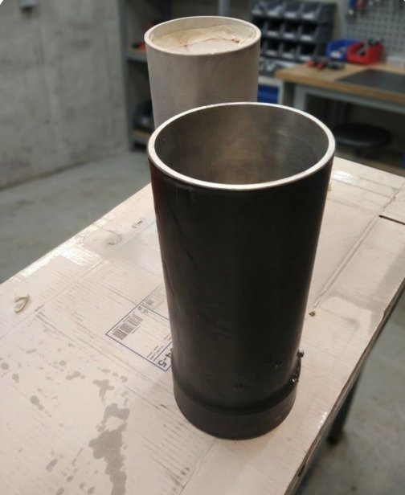
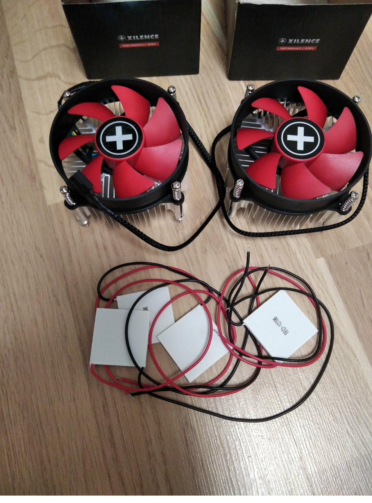
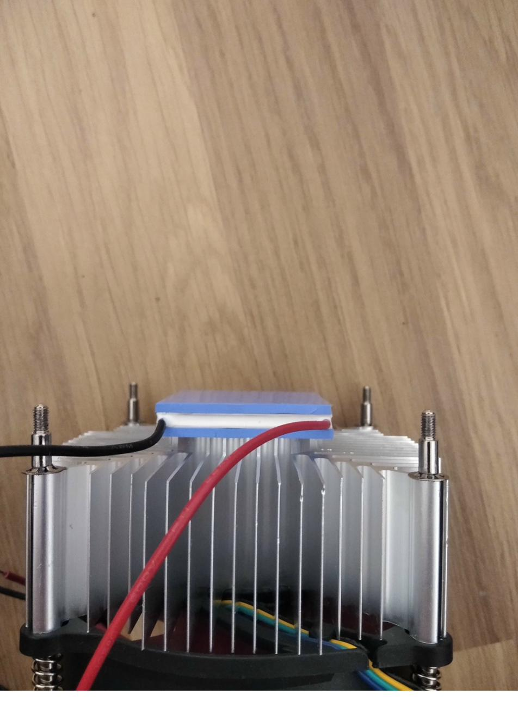
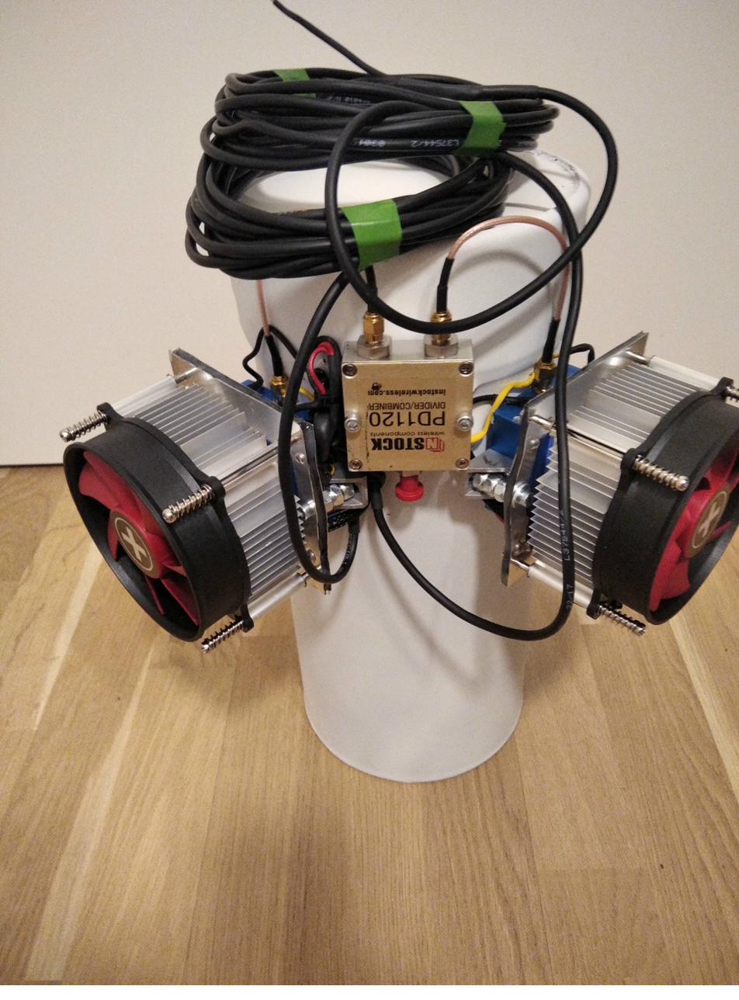

# From a Childhood Dream of a Telescope to Radio Astronomy: Building a 1420 MHz Feed Horn

Ever since childhood, I've been fascinated by space. I dreamed of owning a telescope — but didn't get one until I was an adult. As these things tend to go, the timing was all wrong. I now have a mirror over half a metre in diameter, yet there's never time to simply look through it: what was once an anticipation of wonder has turned into testing software for astro-cameras, image-analysis algorithms, computer vision, and so on. Romance gave way to engineering — but, as it turned out, engineering can be every bit as captivating.

The turning point came on 10 April 2019 — an event that made me see astronomy in an entirely new light.

---

## 2019: Humanity "Sees" a Black Hole for the First Time

On that day the Event Horizon Telescope (EHT) collaboration published the first-ever image of a black hole — the supermassive object at the centre of galaxy Messier 87 (M87*), 55 million light-years from Earth. Its mass is estimated at 6.5 billion solar masses, and the diameter of its event horizon is roughly 40 billion kilometres.

But the most striking thing was not the object itself — it was **the instrument** used to capture the image. Not an optical telescope. Not a spacecraft. It was a **radio interferometer** — a network of eight radio telescopes scattered across the planet, from Hawaii to the South Pole, from Chile to Spain.

### How Very Long Baseline Interferometry (VLBI) Works

The angular resolution of any telescope is determined by its aperture (diameter) and the observing wavelength. Radio wavelengths are millions of times longer than those of visible light, so achieving comparable resolution demands antennas of colossal size. Building a single antenna the size of the Earth is impossible — but one can **emulate** it.

VLBI (Very Long Baseline Interferometry) solves this problem:

1. **Simultaneous recording.** Several radio telescopes separated by thousands of kilometres simultaneously observe the same target at the same frequency (for EHT — at a wavelength of 1.3 mm, i.e. 230 GHz).

2. **Synchronisation with atomic clocks.** Each telescope is equipped with a hydrogen maser — an atomic clock based on a hydrogen-atom transition — providing timing accuracy down to fractions of a nanosecond. This is critical: interferometry requires precise knowledge of the arrival time of the wavefront at each antenna.

3. **Data correlation.** The recorded data (hundreds of terabytes per telescope per day) are physically shipped to a supercomputer-correlator, where the signals are combined with delays accounting for the path-length differences from source to each antenna.

4. **Image reconstruction.** From the correlated data, reconstruction algorithms (including specialised machine-learning methods) recover an image as though the observation had been made with a single giant telescope whose diameter equals the maximum distance between antennas.

As a result, EHT achieved an angular resolution of about 25 microarcseconds — enough to read a newspaper in New York from Paris. This is the very method that produced the shadow image of M87*, and later, on 12 May 2022, the image of Sgr A*, the black hole at the centre of our own Galaxy.

---

## Amateur Radio Astronomy: From Giant Institutes to Backyard Antennas

I used to believe (and it was largely true) that radio astronomy was the province of large research institutes with multi-metre parabolic dishes, cryogenically cooled receivers, and powerful computing centres. That was the case until relatively recently.

Over the past 10–15 years, however, several technological shifts have made amateur radio astronomy quite accessible:

**SDR receivers (Software Defined Radio).** The advent of cheap digital receivers opened up the possibility of receiving and digitising radio signals across a wide frequency range. With hardware modifications (power stabilisation, cooling) and external low-noise amplifiers (LNAs), these devices can be used to observe the 21 cm hydrogen line.

**High-speed internet.** Running a VLBI interferometer requires synchronous data transfer between stations. With the expansion of fibre-optic networks and synchronisation protocols, it has become possible to conduct interferometric observations in real time (e-VLBI), including with relatively small antennas of 2.5–4 metres in diameter.

**High-stability oscillators and GPS/PPS synchronisation.** Amateur VLBI does not require a hydrogen maser costing hundreds of thousands of dollars. Modern OCXOs (oven-controlled crystal oscillators) and disciplined GPS oscillators (GPSDOs) provide stability sufficient for interferometry on short baselines. Synchronising SDR receiver clocks via a PPS signal from a GPS receiver enables coherent observations between distant stations.

Together, these three factors have created an environment in which a group of enthusiasts with 2.5–4 m parabolic dishes, SDR receivers, low-noise amplifiers, and synchronised oscillators can conduct radio-astronomical observations that were once available only to professional observatories.

---

## The Community: The People Who Make It Possible

When I began studying radio astronomy, I discovered a remarkable community. On specialist forums, in SARA (Society of Amateur Radio Astronomers) groups, and in topic-specific chats, I found people of the calibre of senior engineers and university professors who patiently, selflessly, and with genuine enthusiasm explained every nuance — from antenna calculations and LNA noise characteristics to SDR principles and signal-processing techniques.

This community is one of the best things I've found in this hobby. After engaging with these people, radio astronomy grew on me even more. It was their advice and teaching materials that gave me the confidence to take a practical step — building my own feed horn for the hydrogen-line frequency at 1420 MHz.

---

## Why 1420 MHz: The Neutral-Hydrogen 21 cm Line

Before moving on to the construction, it is worth understanding why this particular frequency is so important in radio astronomy.

### The Physics

Hydrogen is the most abundant element in the universe. A neutral hydrogen atom consists of one proton and one electron. Both possess a quantum property — spin (intrinsic angular momentum). The spins of the proton and electron can be aligned parallel (the same direction) or antiparallel (opposite directions).

The parallel-spin state has a slightly higher energy than the antiparallel state. The energy difference between the two is extraordinarily small: just 5.87 microelectronvolts. When the electron in a hydrogen atom transitions from the parallel to the antiparallel spin state (the so-called "spin-flip"), a photon is emitted at a frequency of:

**f = 1420.405751768 MHz**

corresponding to a vacuum wavelength of:

**λ = 21.106 cm**

### Why This Matters

This transition was theoretically predicted by the Dutch astronomer Hendrik van de Hulst in 1944, and first experimentally detected by Harold Ewen and Edward Purcell at Harvard University on 25 March 1951.

The probability of a spin-flip for any individual atom is vanishingly small — on average, one transition every ~10 million years. Yet interstellar space contains colossal quantities of neutral hydrogen, and the aggregate emission of all these atoms produces a detectable radio signal.

Key advantages of observations at 1420 MHz:

- **Penetrating power.** Radio waves at 21 cm pass freely through interstellar dust clouds that are opaque to visible light. This allows us to "see" the structure of the Galaxy through the plane of the Milky Way, including its centre.

- **Galactic-structure mapping.** By measuring the Doppler shift of the 1420 MHz line, one can determine the radial velocity of hydrogen clouds and, using a model of Galactic rotation, reconstruct the spatial distribution of gas — in other words, map the spiral arms of the Milky Way.

- **Radio quiet.** The 1400–1427 MHz band is protected by international agreements (ITU Radio Regulations) and allocated exclusively to radio astronomy. This reduces man-made interference, although in practice adjacent mobile-communication and satellite bands still cause problems.

- **Cosmological significance.** The 21 cm line is the only known way to probe the so-called "Dark Ages" of the universe — the epoch after recombination when matter was neutral and did not radiate in the visible spectrum, yet hydrogen could still emit at 21 cm.

---

## Designing the 1420 MHz Feed Horn

Let us move on to the practical part. I built a waveguide feed horn for operation at the hydrogen-line frequency. Below is a complete engineering calculation of every element.

### Construction Overview

The feed horn comprises three functional parts:

1. **Waveguide** — a cylindrical metal tube, closed at one end. It guides the electromagnetic wave to the receiving point and simultaneously acts as a bandpass filter, rejecting frequencies outside the operating range.

2. **Choke ring (matching collar)** — an annular screen around the open end of the waveguide. Its purpose is to shape the radiation pattern so that the feed horn uniformly "illuminates" the parabolic reflector without picking up excess noise from beyond its edges. Choke rings are typically used with dishes 3 metres or larger. Since I planned to use a 2-metre parabolic reflector, I decided not to install one — to avoid creating additional obstructions for the stellar signal.

3. **Probe (receiving stub)** — a 1 mm silver-plated copper conductor inside the waveguide, connected via a coaxial connector to a low-noise amplifier (LNA) and then to an SDR receiver.

### Choosing the Tube

I used a standard aluminium tube with an inner diameter of **130 mm**. Although it is not the most optimal for 1420 MHz (the resulting structure is longer than with a larger diameter), it works perfectly well. All subsequent calculations are tied to this dimension.

---

### Step 1. Determining the Waveguide Passband

A circular waveguide propagates electromagnetic waves only within a specific frequency window. Below this window the wave cannot propagate; above it, parasitic modes appear and distort reception.

The boundaries of this window are entirely determined by geometry — the inner diameter of the tube. Physically, for the wave to "fit" inside the tube and form a stable field pattern, its wavelength must be commensurate with the waveguide cross-section.

For the fundamental (and only desired) TE₁₁ mode in a circular waveguide, there exists a cutoff wavelength — the maximum wavelength that can still propagate inside the tube. It is related to the diameter through the root of the derivative of the first-order Bessel function of the first kind (p'₁₁ ≈ 1.8412):

$$\lambda_{c} = \frac{\pi \cdot d}{p'_{11}} = \frac{\pi \cdot d}{1.8412}$$

where d is the inner diameter in the same units as λ.

**For d = 130 mm = 0.13 m:**

$$\lambda_{c} = \frac{3.14159 \times 0.13}{1.8412} = \frac{0.4084}{1.8412} = 0.2218 \text{ m} = 221.8 \text{ mm}$$

Converting to frequency (lower passband edge):

$$f_{min} = \frac{c}{\lambda_{c}} = \frac{2.998 \times 10^{8}}{0.2218} = 1.352 \times 10^{9} \text{ Hz} \approx 1352 \text{ MHz}$$

The upper bound of single-mode operation (onset of the TM₀₁ mode) occurs at the wavelength corresponding to the first root of the Bessel function J₀ (p₀₁ ≈ 2.4048):

$$f_{max} = \frac{c \cdot p_{01}}{\pi \cdot d} = \frac{2.998 \times 10^{8} \times 2.4048}{3.14159 \times 0.13} = \frac{7.211 \times 10^{8}}{0.4084} = 1.766 \times 10^{9} \text{ Hz} \approx 1766 \text{ MHz}$$

**Result: the passband of our tube is 1352–1766 MHz.** Our target frequency of 1420.4 MHz falls within this interval. The waveguide will pass the desired signal and filter out interference below ~1350 MHz (mobile communications, radar, navigation).

> **Note.** The target frequency sits only ~5% above the cutoff threshold. This is neither an error nor a problem — the wave propagates, just more slowly. The practical consequence is that the effective wavelength inside the tube increases noticeably, making the waveguide longer. For a more compact build, use a tube with an inner diameter of 140–150 mm — the target frequency will lie further from cutoff, and the length will shrink by nearly half.

---

### Step 2. Calculating the "Stretched" Wavelength Inside the Tube

In free space, the hydrogen-line wavelength is:

$$\lambda_{0} = \frac{c}{f} = \frac{2.998 \times 10^{8}}{1.4204 \times 10^{9}} = 0.2111 \text{ m} = 211.1 \text{ mm}$$

Inside the waveguide the situation is different. The wave is forced to travel not in a straight line but via multiple reflections off the walls (in a ray-optic picture). This causes the effective wavelength along the tube axis to increase. The closer the operating frequency is to the cutoff, the greater the stretching — all the way to infinity right at the cutoff frequency.

The formula follows from the waveguide dispersion relation. Denoting the free-space wave vector as k₀ = 2π/λ₀ and the transverse eigenvalue as kc = 2π/λc, the longitudinal wave vector is:

$$k_{z} = \sqrt{k_{0}^{2} - k_{c}^{2}}$$

The wavelength along the axis:

$$\lambda_{g} = \frac{2\pi}{k_{z}} = \frac{1}{\sqrt{\frac{1}{\lambda_{0}^{2}} - \frac{1}{\lambda_{c}^{2}}}}$$

**Substituting numbers:**

$$\frac{1}{\lambda_{0}^{2}} = \frac{1}{0.2111^{2}} = \frac{1}{0.04456} = 22.44 \text{ m}^{-2}$$

$$\frac{1}{\lambda_{c}^{2}} = \frac{1}{0.2218^{2}} = \frac{1}{0.04920} = 20.33 \text{ m}^{-2}$$

$$\lambda_{g} = \frac{1}{\sqrt{22.44 - 20.33}} = \frac{1}{\sqrt{2.11}} = \frac{1}{1.453} = 0.688 \text{ m} = 688 \text{ mm}$$

**The guide wavelength inside our tube is approximately 688 mm** — more than three times the free-space wavelength (211 mm). This is a direct consequence of the narrow bore and proximity to cutoff.

> **For comparison:** with a 145 mm tube the guide wavelength would be ~408 mm — nearly half. The choice of diameter directly affects the overall dimensions of the structure.

---

### Step 3. Determining the Waveguide Section Length

The waveguide is closed at one end with a metal cap. This cap creates a reflection, and a standing wave forms inside the tube. The waveguide length should be a multiple of a quarter of the guide wavelength to maintain optimal matching at the open end.

The minimum acceptable length is half the guide wavelength (two quarter-wave sections). The recommended length is three quarter-wave sections, which provides a more uniform radiation pattern and better suppression of parasitic modes.

$$L_{min} = 2 \times \frac{\lambda_{g}}{4} = \frac{688}{2} = 344 \text{ mm}$$

$$L_{rec} = 3 \times \frac{\lambda_{g}}{4} = \frac{3 \times 688}{4} = 516 \text{ mm}$$

I cut the tube to approximately **500–520 mm** — within the recommended range.

---

### Step 4. Placing the Receiving Probe

Inside a waveguide closed at one end, a standing wave forms with alternating nodes (zero amplitude) and antinodes (maximum amplitude) of the electric field. The cap is a node of the electric field (and an antinode of the magnetic field). The first electric-field antinode lies one quarter of the guide wavelength from the cap.

This is precisely where the probe must go — at the point of maximum field intensity:

$$S = \frac{\lambda_{g}}{4} = \frac{688}{4} = 172 \text{ mm from the cap}$$

**Probe length.** The probe operates as a quarter-wave monopole, so its length equals a quarter of the free-space wavelength (near the probe the field is local, and its interaction with the probe is governed by the free-space wavelength):

$$l = \frac{\lambda_{0}}{4} = \frac{211}{4} \approx 53 \text{ mm}$$

The probe is a silver-plated copper wire, 1 mm in diameter (more on the choice of material below). It is soldered to the centre pin of an N-type coaxial connector (50 Ω), which is mounted in the waveguide wall. The probe points radially inward, perpendicular to the tube axis.

---

### Dimension Summary

| Element | Derivation | Value |
|---------|-----------|-------|
| Waveguide bore | Selected (standard tube) | 130 mm |
| Lower cutoff frequency | c·p'₁₁ / (π·d) | 1352 MHz |
| Upper single-mode limit | c·p₀₁ / (π·d) | 1766 MHz |
| Free-space wavelength (λ₀) | c / f | 211 mm |
| Cutoff wavelength (λc) | π·d / p'₁₁ | 222 mm |
| Guide wavelength (λg) | Dispersion relation | 688 mm |
| Waveguide section length | 3·λg / 4 | ~516 mm |
| Probe offset from cap | λg / 4 | 172 mm |
| Probe length | λ₀ / 4 | 53 mm |

---

### Polarisation and Dual-Probe Reception: Polarimetry + Signal Enhancement

For cosmic signals the notions of "vertical" and "horizontal" polarisation have no absolute meaning — they are defined by the mutual orientation of source and receiver, not by some fixed coordinate system. Interstellar hydrogen emission may be unpolarised, partially polarised, or have an arbitrary polarisation-plane orientation. A single probe in the waveguide captures only the field component aligned with it; the orthogonal component is lost.

For this reason I designed the feed horn with **two probes mounted perpendicular to each other** inside the same waveguide — the classic polarimeter scheme. Both probes sit at the same distance from the cap (172 mm) but are rotated 90° relative to each other. Each probe is connected via its own coaxial N-type connector to its own **dedicated low-noise amplifier (LNA)**. This is a crucial point: amplification must occur before any signal combining, otherwise the noise from one channel will swamp the useful signal in the other.

This arrangement enables two operating modes:

**Polarimeter mode.** Connecting each amplifier to a separate SDR input (or to two receivers) allows simultaneous registration of two orthogonal electric-field components. By comparing their amplitudes and phases one can determine the Stokes parameters and, consequently, the degree of polarisation, the tilt angle of the polarisation plane, and even distinguish linear from circular polarisation. For astrophysics this is invaluable — polarisation carries information about magnetic fields along the line of sight.

**Summation (sensitivity-boost) mode.** When polarimetry is not needed and maximum sensitivity is the priority, both amplified signals are fed into an **InStock Wireless PD1120 power combiner**. Since an unpolarised signal (and hydrogen emission is generally unpolarised or weakly polarised) is present in both components, summing the two channels yields a noticeable improvement in signal-to-noise ratio — in practice the gain was **tens of percent** compared with single-probe reception. Physically this makes sense: instead of capturing only one projection of an unpolarised wave, we collect energy from both orthogonal components.

Switching between modes is purely a matter of cabling: disconnect the cables from the combiner and plug them into two separate inputs — polarimeter; connect via PD1120 — maximum sensitivity. No waveguide reconfiguration is needed.

### Probe Material: Silver-Plated Copper

For the probes I used **silver-plated copper wire, 1 mm in diameter**, found by chance on eBay. Plain copper wire will also work. However, silver plating provides a real advantage at microwave frequencies, and here is why.

At 1420 MHz, high-frequency currents do not flow through the entire cross-section of the conductor but concentrate in a thin surface layer — the skin effect. The thickness of this layer (skin depth) at 1.4 GHz is approximately 1.8 µm for copper and about 1.7 µm for silver. In other words, all the current flows through literally the first few micrometres of the surface. Silver has the lowest resistivity of any metal (1.59 × 10⁻⁸ Ω·m versus 1.68 × 10⁻⁸ for copper), and at microwave frequencies — where all conductivity is concentrated at the surface — it is the plating material that determines losses. The difference is small in absolute terms, but in radio astronomy, where the hydrogen-line signal may be at the level of tens of kelvins equivalent temperature while receiver noise runs into hundreds of kelvins, every fraction of a decibel counts.

---

## Components and Their Role in the System

In addition to the aluminium waveguide tube, the design includes:

**Two low-noise amplifiers (LNAs)** — one per receiving probe. This is arguably the most critical component in the entire system, and my choice was the result of a long journey of experimentation.

I tried many options. I ordered cheap broadband LNAs from AliExpress — they worked, but their noise performance left much to be desired. I bought boards from people professionally involved in radio astronomy — the results were considerably better. I soldered amplifiers myself from open-source schematics — this gave useful experience, but without proper test equipment (and a decent noise-figure meter at 1.4 GHz is a story in itself) repeatability of parameters remained uncertain.

The best result in terms of noise temperature / price / availability I eventually found on eBay: **bare-board LNAs labelled "1420 MHz Hydrogen Line"**, specifically designed for amateur radio astronomy. These modules are produced in small batches by engineer-enthusiasts who themselves work in the field. The boards are optimised for a narrow band around 1420 MHz — transistor bias points are tuned, and matching networks are set for minimum noise figure in the target range. Unlike broadband amplifiers covering "100 MHz to 6 GHz", whose noise temperature is optimised "on average", these specialised modules squeeze the minimum noise right where it is needed.

The bare-board format is not a drawback but an advantage: you can choose or fabricate a housing yourself, ensuring optimal thermal contact with the Peltier module. In my design each LNA is mounted as close to the waveguide as possible to minimise the cable length between probe and amplifier — every centimetre of cable before the first gain stage adds losses that directly increase the effective system noise temperature.

**InStock Wireless PD1120 combiner/splitter.** A two-port power combiner with a common output port. Mounted on the waveguide body between the two LNAs. In summation mode it combines both channels; when disconnected, each channel operates independently for polarimetry.

**TEC1-12706 Peltier modules.** Thermoelectric coolers installed beneath each LNA. They lower the amplifier's operating temperature by 20–30 °C, which proportionally reduces its intrinsic noise temperature. For the weak hydrogen-line signal this is critical: the equivalent antenna temperature when observing galactic hydrogen is on the order of 50–100 K, while a typical GaAs-transistor LNA has a noise temperature of ~100 K at room temperature. Cooling by 25 °C reduces amplifier noise by 10–15%, yielding a direct gain in sensitivity.

**Xilence Performance C Series CPU coolers.** Heatsinks with active fans, mounted on the hot side of the Peltier modules. A Peltier element does not destroy heat — it pumps it from the cold side to the hot side, and the module's own dissipated power is added on top. Without efficient heat removal from the hot side the entire system quickly reaches thermal equilibrium and ceases to cool.

**Thermally conductive double-sided tape.** Provides thermal contact in the "LNA housing — Peltier module — heatsink" stack. The alternative is thermal paste with mechanical clamping, but tape is structurally simpler for mounting on vertical surfaces.

---

## The Assembled Structure

The completed feed horn is a cylindrical waveguide approximately 520 mm long with a choke ring at the open end. On the waveguide wall, 172 mm from the cap, two coaxial N-type connectors with silver-plated probes inside are mounted diametrically opposite each other (rotated 90°). On the outside, each connector feeds its own LNA — a bare board mounted in a custom metal enclosure for shielding and thermal coupling to the cooling system. Beneath each LNA sits a Peltier module, and beneath that a CPU cooler with fan. Between the two amplifiers, on the waveguide body, sits the PD1120 combiner, connected to them by short coaxial jumpers. The combiner output goes via cable to the SDR receiver.

The entire structure is mounted at the focal plane of a parabolic antenna. For calibration and operational verification, the Sun (a powerful broadband radio source) and geostationary satellites (INMARSAT, etc.) are used — their known parameters allow assessment of the system's sensitivity and pointing accuracy.

---

## Angular Resolution: What the Antenna "Sees"

For completeness, here is an estimate of the angular resolution of a single parabolic antenna. The minimum resolvable angle (Rayleigh criterion for a circular aperture):

$$\theta_{min} \approx 1.22 \frac{\lambda_{0}}{D_{dish}}$$

For a 3-metre dish at a wavelength of 211 mm:

$$\theta_{min} \approx 1.22 \times \frac{0.211}{3} \approx 0.086 \text{ rad} \approx 4.9°$$

Such an antenna "sees" a patch of sky about 5 degrees across — roughly ten full lunar discs. This is sufficient for detecting the hydrogen line from various regions of the Galaxy and constructing a hydrogen-distribution map of the Milky Way's spiral arms by radial velocity (via Doppler shift).

For higher resolution, one needs either larger antennas or — as the EHT demonstrated — interferometers.

---

## Conclusions and Next Steps

The design described — a waveguide feed horn with dual-probe polarimetric reception, active LNA cooling, and channel-summation capability — constitutes a working feed-horn assembly for observing galactic hydrogen at 1420 MHz. All calculations are given for an aluminium tube with a 130 mm bore; for a different diameter the parameters must be recalculated using the same formulae.

Logical next steps include: connecting to a dedicated spectrometer (rather than a broadband SDR), automating coordinate scanning, accumulating data for a hydrogen radial-velocity map along the Galactic plane, and — in the longer term — participation in amateur VLBI networks.

---

*This article is for educational and informational purposes. The calculations, schematics, and methods described reflect my personal experience and do not constitute peer-reviewed engineering documentation.*
